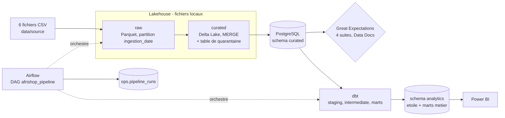

# AfriShop Lakehouse

Plateforme de centralisation et de traitement analytique des données e-commerce panafricain
(Sénégal, Côte d'Ivoire, Ghana, Nigeria). Les fichiers sources (6 CSV) sont ingérés dans un
lakehouse à trois zones, nettoyés, contrôlés, puis modélisés en schéma en étoile dans PostgreSQL,
pour alimenter les tableaux de bord Power BI et les recommandations à la direction.

## Architecture



| Zone | Technologie | Rôle |
|---|---|---|
| raw | Parquet, partition `ingestion_date=AAAA-MM-JJ` | Copie fidèle des CSV, archivage, réécriture idempotente de la partition |
| curated | Delta Lake 3.2.1 (PySpark 3.5.3, mode local) | Dédoublonnage, typage, quarantaine motivée, anonymisation, MERGE sur clé métier |
| analytics | PostgreSQL 15 + dbt 1.8 | Schéma en étoile (SCD2), marts RFM, rotation produits, taux de retour |

## Prérequis

Docker Desktop, 8 Go de RAM disponibles pour Docker, Git. Python et Java ne sont pas nécessaires
sur la machine hôte : tout s'exécute dans les conteneurs.

## Démarrage rapide

```powershell
copy .env.example .env          # puis renseigner les mots de passe et HASH_SALT
docker compose up -d            # PostgreSQL + Airflow
```

Airflow : http://localhost:8081 (le port est défini dans `docker-compose.yml`).
PostgreSQL depuis l'hôte : `localhost:5434`.

Placer les 6 CSV dans `data/source/`, puis lancer le DAG `afrishop_pipeline` depuis l'interface
(ou `docker compose exec airflow-scheduler airflow dags trigger afrishop_pipeline`).

## Commandes utiles

| Action | Commande |
|---|---|
| Tests et couverture | `docker compose run --rm tests python -m pytest --cov` |
| Tests des suites d'attentes | `docker compose run --rm tests /opt/airflow/venvs/ge/bin/python -m pytest tests/test_quality_expectations.py` |
| Qualité du code | `docker compose run --rm tests ruff check src tests dags` puis `black --check` et `mypy` |
| Qualité SQL | voir le runbook (sqlfluff) |
| dbt (seed, snapshot, run, test) | `docker compose run --rm dbt run` (idem `seed`, `snapshot`, `test`) |
| Validation de la qualité | `docker compose run --rm ge python -m afrishop.quality.validate --fail-on-error` |

## Organisation du dépôt

```
dags/                  DAG Airflow
src/afrishop/          ingestion raw, curated, chargement Postgres, qualité, métriques
dbt/                   modèles (staging, intermediate, marts), snapshots, seeds, tests
infra/                 Dockerfiles (Airflow, dbt, Great Expectations, tests) et init Postgres
scripts/               profilage, contrôles, démonstration d'arrivée tardive et remise à zéro
tests/                 tests pytest
docs/                  dictionnaire de données, runbook, biais et limites
reports/ge/            rapports Great Expectations (Data Docs HTML)
```

## Choix de conception

- **Idempotence** : la partition raw d'une date est réécrite ; le curated utilise un MERGE sur la
  clé métier. Rejouer un jour ne crée aucun doublon (vérifié par un backfill).
- **Quarantaine** : chaque enregistrement rejeté est conservé avec sa raison (`BAD_TOTAL`,
  `NO_LINES`, `ORPHAN_PRODUCT`, `AMBIGUOUS_CUSTOMER_ID`...) dans `curated.quarantine`.
- **Confidentialité** : e-mails et téléphones sont re-hachés (SHA-256 avec sel `HASH_SALT`), les
  noms sont supprimés (minimisation), un `master_customer_id` regroupe les comptes en doublon.
- **Historisation** : dimensions client et produit en SCD de type 2 via les snapshots dbt ;
  jointure « à la date de la commande » et membre inconnu `-1`.
- **Qualité à trois niveaux** : règles de nettoyage (curated), suites Great Expectations,
  65 tests dbt.
- **Observabilité** : journaux JSON, métriques d'exécution dans `ops.pipeline_runs`, reprises
  automatiques, SLA et callbacks d'échec dans le DAG.

## Documentation

- [Dictionnaire de données](docs/data_dictionary.md)
- [Runbook d'exploitation](docs/runbook.md)
- [Biais, limites et usages interdits](docs/bias_and_limits.md)
- [Rapport de profilage](docs/profiling_report.md) (généré par `scripts/profile_data.py`)
- [Journal des changements](CHANGELOG.md)
- [Rapport final](docs/rapport_final.pdf) : synthèse du projet, résultats analytiques et recommandations pour la direction
- Lignée dbt : [fact_order_line](docs/images/fact_order_lineage_graph.png) et [mart_customer_rfm](docs/images/mart_customer_rfm_lineage_graph.png)